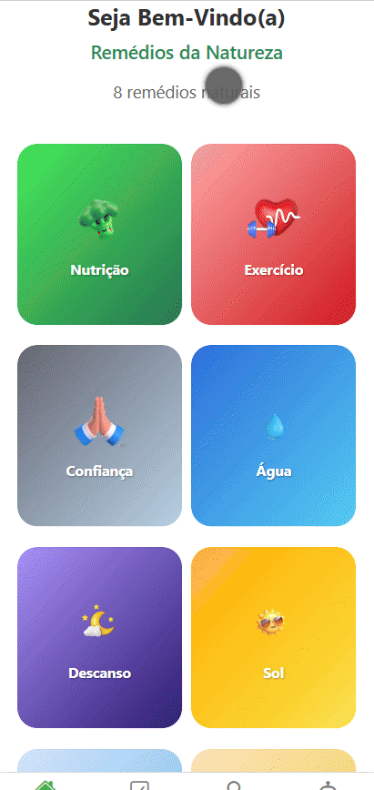

# 🌿 **Eight Ways - 8 Caminhos para uma Saúde Melhor** 📱



## 🏥 **Sobre o Projeto**
O **Eight Ways** foi desenvolvido com base nos **8 remédios naturais de Ellen G. White**, promovendo hábitos saudáveis de forma acessível e intuitiva. Nosso projeto consiste em um **aplicativo mobile** 📲 que auxilia os usuários na implementação desses hábitos no dia a dia.

### ✨ **Funcionalidades**
- 🏠 **Página inicial** com divisão dos **8 remédios naturais**.
- ✅ **Questionário diário** para avaliação do progresso do usuário.
- 🎯 **Seção "Meus Objetivos"** para acompanhamento e personalização de metas.
- 🔍 **Área de recomendações** com sugestões de objetivos para cada remédio natural.
- 🤖 **Chatbot Lumin**, que responde dúvidas sobre os remédios e auxilia no processo de mudança de hábitos.

### 🎨 **Interface**
Nosso design prioriza a **intuitividade**, com botões visíveis e mensagens de confirmação ✅ para funções essenciais, como exclusão e adição de objetivos.

## 🛠 **Passo a Passo para Rodar o Projeto**
### 📌 **Pré-requisitos**
Antes de iniciar, certifique-se de ter os seguintes softwares instalados:
- 🐍 **Python** (para os backends)
- 🚀 **Node.js** e **npm** (para o frontend)
- 📦 **Bibliotecas** listadas nos arquivos `requirements.txt`

### ⚙️ **Configuração do Backend**
#### 🤖 **ChatBot**

Criar e ativar ambiente virtual
```bash
python -m venv env
./env/Scripts/activate
```

Instalar dependências
```
pip install -r requirements.txt
```

Iniciar o servidor
```
uvicorn main:app --host 0.0.0.0 --port 5000 --reload
```


### 📝 CRUD de Objetivos
Criar e ativar ambiente virtual
```bash 
python -m venv env
./env/Scripts/activate
```

Instalar dependências
```bash
pip install -r requirements.txt
```

Iniciar o servidor
```bash
uvicorn main:app --host 0.0.0.0 --port 8000 --reload
```

### 🎨 Configuração do Frontend
Acesse a pasta do frontend via Visual Studio Code
Instale as dependências
```bash
npm install
```

# Ajuste o endereço IP da sua máquina nas chamadas das APIs no frontend
 Exemplo:
 http://<SEU_IP>:8000/usuarios/1/objetivos_personalizados/

Inicie o projeto
```bash
npx expo start
```

*🔹 Observação: Para visualizar o aplicativo, escaneie o QR Code gerado com o aplicativo Expo Go instalado no seu celular 📱.*

### 🚀 Tecnologias Utilizadas

🛠 Linguagens de programação: Python, React Native

📲 Softwares necessários: Expo Go para visualização mobile

📦 Bibliotecas: langchain, langchain-groq, FastAPI, Uvicorn

🎨 Ferramentas de prototipação: Figma


### 🔮 Futuras Implementações

🏡 Implementar telas individuais para cada remédio natural.

🔄 Melhorar atualização em tempo real das funcionalidades.

🧐 Refinar o chatbot Lumin para respostas mais precisas.

🚀 Realizar o deploy para produção.

### 👩‍💻 Integrantes

👩 Gabriela Alejandra Bergamine dos Santos - 3º Semestre, SI B

👨 João Pedro dos Santos Adegas - 3º Semestre, SI B

👨 Pedro Sérgio - 3º Semestre, SI B

### 🔗 Links Importantes

📹 Vídeo de demonstração (privado): YouTube

🎯 Hackathon 2025 - Unasp Tech: Evento
